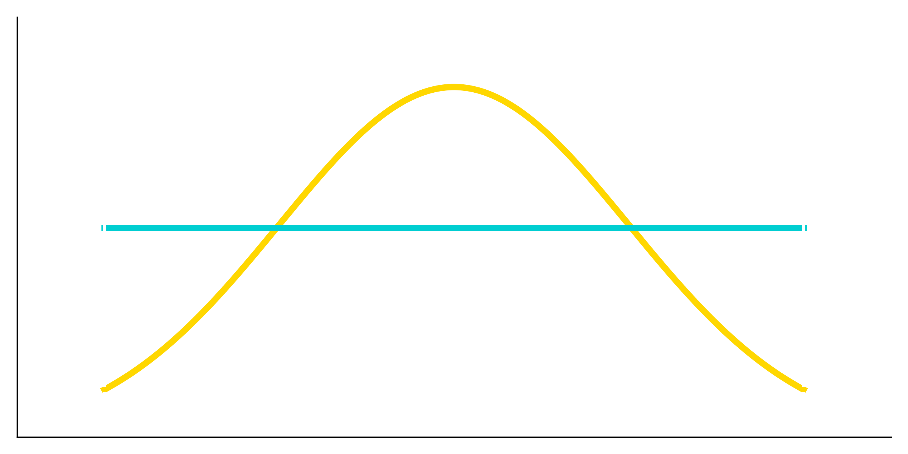

# Importance Sampling for SST

    

This repository provides tools for **Importance Sampling (IS)** and **Adaptive Importance Sampling (AIS)** applied to **Stochastic Storm Transposition (SST)**.  

The codebase is organized into modules for sampling, preprocessing, depth processing, and additional utilities for analysis, along with example data and notebooks.  
Sphinx documentation is also included for detailed reference.

## **User Guide**

A full user guide with examples and API documentation is available in the Sphinx docs: [View Documentation](https://htmlpreview.github.io/?https://raw.githubusercontent.com/fema-ffrd/Importance-Sampling-for-SST/main/site/index.html)

### Prerequisites

Before you can start developing, please make sure you have the following software installed on your machine:

- [Docker Desktop](https://www.docker.com/products/docker-desktop/)
- [Visual Studio Code (VSCode)](https://code.visualstudio.com/download)
- [Remote - Containers extension for VSCode](https://marketplace.visualstudio.com/items?itemName=ms-vscode-remote.remote-containers)

### Setting up the Development Environment

- Make sure Docker Desktop is running.
- Clone the repository to your local machine.
- Open the project folder in VSCode.
- When prompted, click on "Reopen in Container" to open the project inside the devcontainer.
- If you don't see the prompt, you can manually open the command palette (`Ctrl+Shift+P` or `Cmd+Shift+P`) and select "Dev Containers: Rebuild and Reopen in Container".
- Wait for the devcontainer to build and start. This may take a few minutes if it is the first time you have opened the project in a container.

### Adding dependencies

Use the `env.yaml` file at the project root directory to keep pinned dependencies up-to-date and version controlled.

> Only include top level dependencies in this file (i.e. only packages you explicity want installed and use in your code) and Only inlcude the major.minor version (this allows all patches to automatically be applied when the project is rebuilt)

If your dependencies are more complex (i.e cannot be installed / managed with micromamba alone) you may need to update the `.devcontainer/Dockerfile` and apply similar modification to the production `Dockerfile`.

### Key Components

- **`SSTImportanceSampling/`**  
  Core library implementing IS and AIS methods (uniform, truncated Gaussian, copula, mixture, adaptive mixture).  

- **`example-input-data/`**  
  Sample `config.json` and geospatial files showing expected input format and structure.  

- **`notebooks/`**  
  Jupyter notebooks used for experimentation.  

- **`docs/`**  
  Sphinx-based documentation with guides, API references, and user tutorials.  
